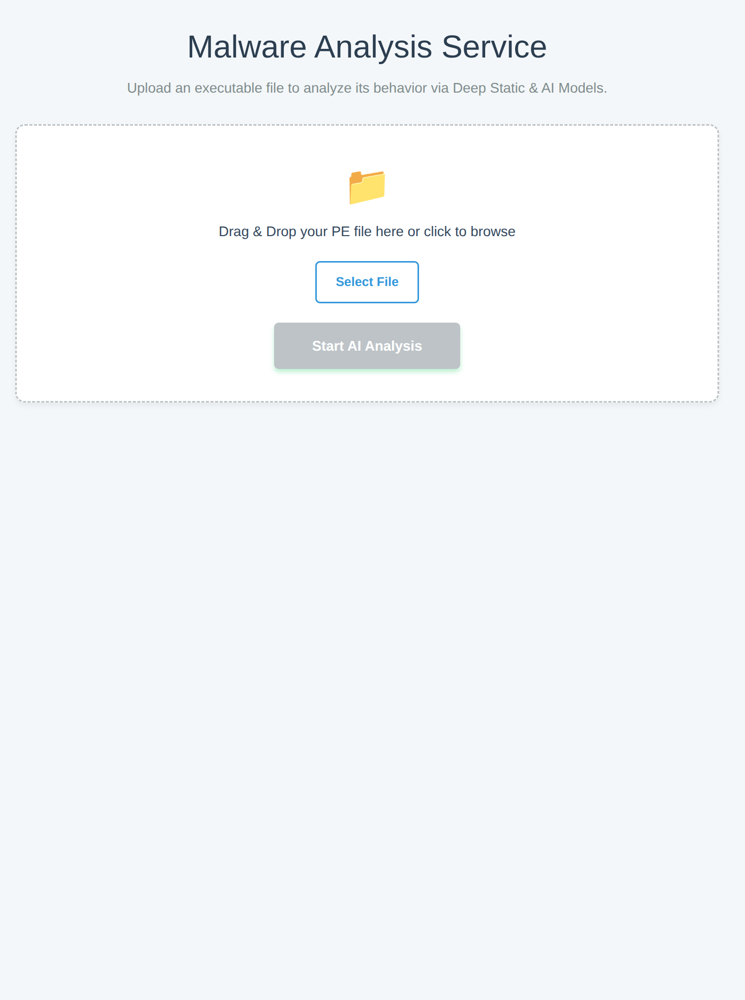
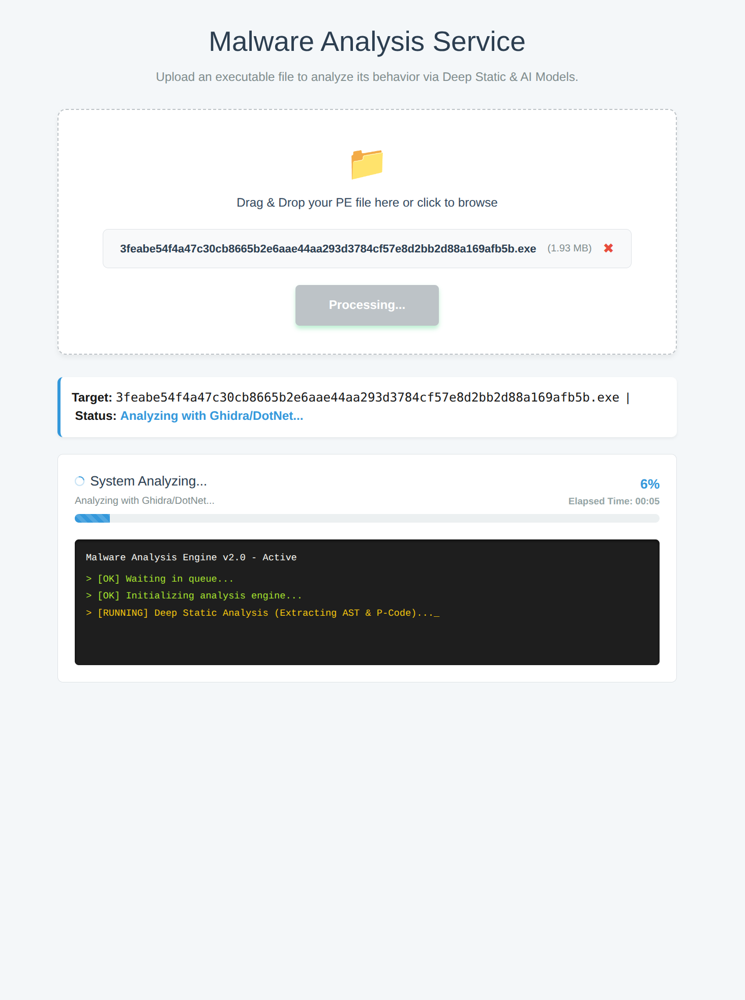
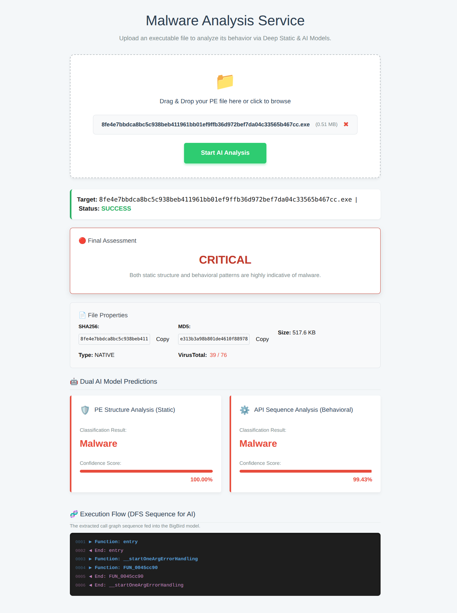
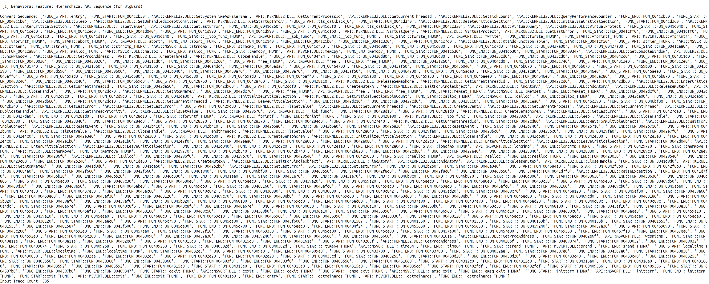

# 하이브리드 AI 기반 악성코드 판별 시스템

> **API 호출 시퀀스 예측 및 PE 구조 분석을 결합한 통합 탐지 파이프라인**
> [상세 발표 자료 보기 (PDF)](./docs/malware_classification.pdf)

본 프로젝트는 정적 분석의 한계와 동적 분석의 제약을 동시에 해결하기 위해 개발되었습니다. Ghidra P-Code 분석을 통한 행위 예측 모델과 PE 구조 분석 모델을 결합한 하이브리드 접근법을 고안해냈습니다.

---

## 프로젝트 핵심

- **프로젝트 기획:** 단순히 "어떤 API가 있는가?"를 넘어 "어떤 순서로 호출되는가?"가 악성 행위의 본질이라는 점에 착안했습니다.
- **현실적인 전환:** 웹 서비스 환경에 부합하지 않는 무거운 샌드박스(CAPEv2) 대신, **Ghidra + DFS 알고리즘**을 통해 실시간에 가까운 속도로 행위 기반 분석을 구현했습니다.

| 1. 파일 업로드 및 분석 요청 | 2. 실시간 파이프라인 모니터링 |
| :---: | :---: |
|  |  |
| 사용자의 PE 파일을 안전하게 수신합니다. | 분석 단계별 로그를 터미널 스타일로 제공합니다. |

| 3. 하이브리드 AI 판별 결과 및 DFS 시퀀스 시각화 | 
| :---: |
|  | 
| 두 모델의 교차 검증 결과와 추출된 실행 흐름 시퀀스를 상세히 출력합니다. | 

| 4. 최종 변환된 계층적 API_Sequence |
| :---: |
| |
| 단순히 파일에 포함된 API 목록을 나열하는 방식은 코드의 의도를 파악하기 어렵습니다. 고안한 계층적 구조는 함수의 시작과 끝을 추적하여, 어떤 함수 내에서 어떤 API들이 특정 목적을 위해 뭉쳐서 호출되는지를 시퀀스화했습니다.  |


## 시스템 아키텍처

사용자 업로드부터 최종 판별까지 총 5개의 레이어로 구성된 비동기 처리 파이프라인입니다.

1. **Layer 1 (Presentation):** Next.js 기반 실시간 대시보드
2. **Layer 2 (API Gateway):** FastAPI를 통한 파일 수신 및 유효성 검사
3. **Layer 3 (Task Queue):** Celery & Redis를 이용한 대규모 분석 작업 분산
4. **Layer 4 (Analysis & Inference):**
    - **Ghidra/dnlib:** 함수 호출 그래프(Call Graph) 추출
    - **DFS Preprocessor:** 실행 흐름 시퀀스 생성
    - **Dual AI Models:** BigBird(행위) & LightGBM(구조) 추론
5. **Layer 5 (Data Persistence):** PostgreSQL을 이용한 분석 결과 및 해시 캐싱

## 하이브리드 AI 모델링

### 1. API 시퀀스 분석 모델 

- **Input:** exe, dll 파일
- **Features:** file_type(native, .net), api_sueqence
- **Preprocessing** dfs를 이용한 정렬, baseline(32bit, 64bit)
- **FIDB, SIM** 함수명 복원을 위해 Trellix FIDB, SIM 사용 

### 2. PE 구조 분석 모델 

- **Features:** PE 헤더 정보, 섹션 엔트로피, 디지털 서명 유효성 등 32개 특징 추출

## 문제 해결 및 기술적 성장 
- **Stripped 바이너리의 함수명 복원 문제:**
    - **상황:** 분석 대상 파일이 심볼 정보가 제거된 상태인 경우, 의미 있는 함수명을 파악하기 어려워 분석 정확도가 저하되는 문제 발생.
    - **해결:** Ghidra의 **Fidb**와 **Sim** 기술을 도입. 특히 **Trellix**에서 제공하는 라이브러리 시그니처와 스크립트를 활용하여 공통 라이브러리 함수를 복원함. 또한, 환경별 분석 기준점 확립을 위해 **Baseline 설정**을 최적화하여 함수 식별률을 극대화함.
- **동적 분석 환경 구축의 제약 극복:**
    - **상황:** 초기 목표였던 CAPEv2 샌드박스의 KVM 가상화 이슈와 긴 분석 시간으로 인해 실시간 웹 서비스 적용에 한계 확인.
    - **해결:** 무거운 가상 환경 대신 Ghidra의 디컴파일 기능을 정적으로 활용하는 대안을 수립. **P-Code 및 AST 분석**을 통해 실제 실행 없이도 동적 분석과 유사한 **예측 실행 시퀀스**를 생성하는 경량 파이프라인을 구축함.
- **간접 호출(Indirect Call) 대응을 위한 P-Code 분석:**
    - **상황:** 악성코드가 레지스터 기반 호출을 사용하여 정적 분석 도구가 함수 호출 흐름을 정상적으로 그리지 못하고 단절되는 현상 발생.
    - **해결:** Ghidra의 중간 언어인 **P-Code 레벨**에서 데이터 흐름을 추적하여 간접 호출의 목적지 주소를 식별하고, 단절된 제어 흐름을 재구성하여 분석의 사각지대를 보완함.

## 향후 계획 

- **데이터셋 고도화:** 상용 소프트웨어 설치 파일(Installer) 대규모 수집을 통한 오탐(False Positive) 감소
- **실측 기반 분석:** API 후킹 기술을 도입하여 예측을 넘어선 경량 동적 분석 엔진 구축
- **한정된 확장자:** PE포맷에 대해서만 판별이 가능함. 향후 ELF, APK 포맷에 대해서도 판별 가능하게 고도화 

## 시작하기 (Getting Started)

이 프로젝트는 대용량 AI 모델과 외부 분석 도구(Ghidra)를 사용하므로, 환경에 따른 추가 설정이 필요합니다.

### 1. 사전 요구 사항 (Prerequisites)
* **Ghidra (11.x 이상):** 시스템에 Ghidra가 설치되어 있어야 합니다. [다운로드](https://ghidra-sre.org/)
* **Docker & Docker Compose:** 데이터베이스(Postgres)와 메시지 브로커(Redis) 실행을 위해 필요합니다.
* **Python 3.12+ / Node.js 18+**
* **.NET SDK 8.0:** .NET 분석기 빌드를 위해 필요합니다.

### 2. AI 모델 준비 (Models)
본 프로젝트의 AI 모델 파일은 대용량인 관계로 Git 저장소에서 제외되었습니다. 아래 경로에 모델 파일을 배치해야 정상 동작합니다.
* `models/bigbird_from_scratch_best/`: 학습된 BigBird 모델 파일들 (`config.json`, `model.safetensors` 등)
* `models/pro_best_detector_lightgbm.joblib`: 정적 분석용 LightGBM 모델 파일

### 3. 환경 변수 설정 (.env)
루트 디렉토리에 `.env` 파일을 생성하고 본인의 환경에 맞게 입력합니다. (내부 코드에서 이 경로를 참조하여 분석을 수행합니다.)

```text
# VirusTotal API Key
VT_API_KEY=your_api_key

# 기드라 설치 절대 경로 (예: /opt/ghidra_11.x)
GHIDRA_INSTALL_PATH=/your/path/to/ghidra
